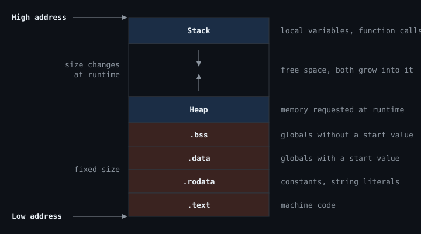

## What is a process?

A program such as Google Chrome is a file on disk. When you click its icon, the operating system loads that file into memory and starts executing it. This running instance of a program is called a process.

Each process gets its own private block of memory, the address space. It is a long row of numbered bytes, running from low addresses to high addresses.

## Where does a process keep its data?

A process needs room for its code, for its variables and for data it creates while running. The address space is divided into regions, one for each kind of data.



Stack and heap grow toward each other.

## The regions

The memory regions fall into two groups. The first four come from the binary. Their size is fixed at compile time.

The other two, stack and heap, are set up by the kernel when the program starts. Their size changes while the program runs.

### Binary regions

- **`.text`** holds the machine code: the compiled instructions that the CPU executes.
- **`.rodata`** holds constants and string literals. They never change while the program runs.
- **`.data`** holds global and static variables that have a start value. The values are stored in the program file.
- **`.bss`** holds global and static variables without a start value. They are set to zero at startup, so the program file only stores their size.

### Runtime regions

- **Heap** holds memory that the program requests at runtime, for example with `malloc`. It stays allocated until it is freed.
- **Stack** holds local variables and the bookkeeping of function calls. Each call adds a frame, each return removes it.

## A C example

Each line of this program is annotated with the region it ends up in.

```c
#include <stdio.h>
#include <stdlib.h>

int visitors = 42;                  // .data    (global with a start value)
int counter;                        // .bss     (global without a start value)

int main(void) {                    // .text    (the code of main)
    int local = 7;                  // stack
    int *list = malloc(40);         // heap     (the 40 bytes)
    printf("Hello\n");              // .rodata  (the text "Hello\n")
    getchar();
    free(list);
    return 0;
}
```

The `malloc` line involves two regions: the 40 bytes are on the heap, while the pointer `list` is a local variable on the stack.

## Examine a live process memory layout

On Linux, every process exposes its layout in the file `/proc/<pid>/maps`. While the program waits at `getchar`, run `cat /proc/<pid>/maps` in a second terminal (`pgrep <binary-name>` prints the pid). The output shows the memory layout of the live process. It is shortened here to the address range and the name, and the arrows are added. Note that the order is reversed compared to the diagram above: maps lists low addresses first.

```console
$ cat /proc/71478/maps
56dd41099000-56dd4109a000   blog1.o     <- .text
56dd4109a000-56dd4109b000   blog1.o     <- .rodata
56dd4109c000-56dd4109d000   blog1.o     <- .data, .bss
56dd7ca72000-56dd7ca93000   [heap]
7b7a25200000-7b7a25406000   libc.so.6   (5 lines merged)
7ffe9f95b000-7ffe9f97c000   [stack]
```

Read from bottom to top, the output matches the diagram: the program's own regions at low addresses, then the heap, and the stack near the top. The line in between belongs to a shared library, which is loaded into the free space. The exact addresses differ on every run.

The next posts take a closer look at the stack and the heap.
